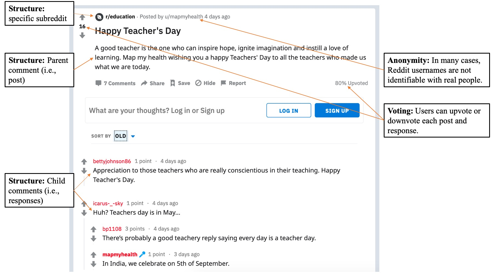
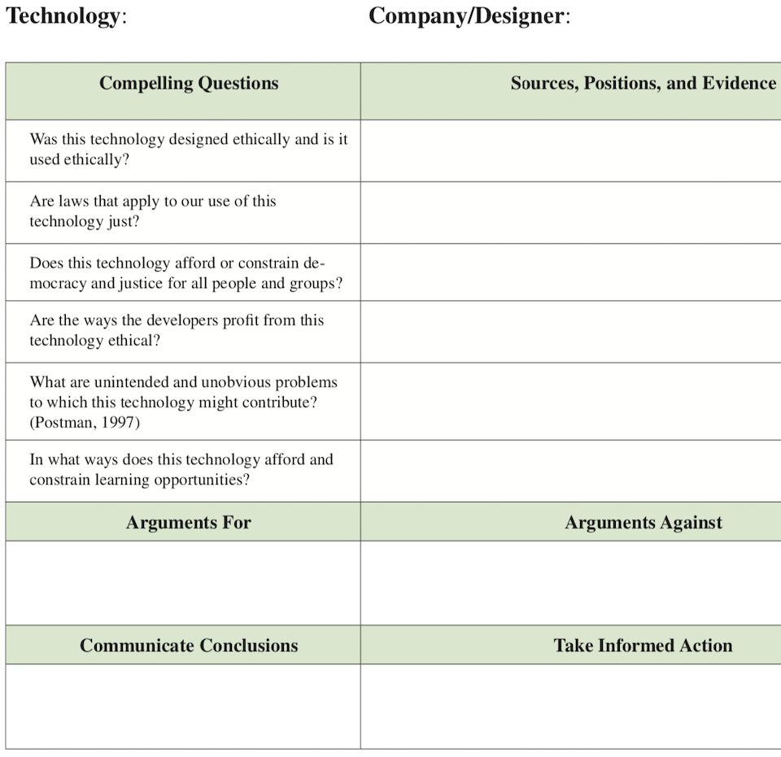

```{r setup, include=FALSE, message=FALSE}
usethis::use_git_ignore(c("*.csv", "*.rds"))
options(htmltools.dir.version = FALSE)

#titleSlideClass: [inverse, center, middle]
#"default", "metropolis", "metropolis-fonts", 

# see options for customize slides: 
# https://slides.yihui.name/xaringan/
# https://slides.yihui.name/xaringan/incremental.html
# https://github.com/yihui/xaringan/wiki

library(knitr)
library(tidyverse)
library(xaringan)
library(kableExtra)
```

# Reddit: Example post

```{r, out.width = "840px", echo = FALSE, fig.align = "center"}

```

---

# Reddit: Daily contributions

```{r, out.width = "840px", echo = FALSE, fig.align = "center"}
include_graphics("img/subreddit-contributions-over-time-comparison.png")
```

---

# Reddit: Discourse comparison

```{r, out.width = "480px", echo = FALSE, fig.align = "center"}
include_graphics("img/subreddit-post-plot-bar.png")
```

---

# Defining learning

*Situative perspective on learning,* which holds that cognition is:

- **Situated** in particular physical and social contexts
- **Social** in nature
- **Distributed** across the individual, other persons, and tools

<p style="font-size:50%">
Putnam, R. T., & Borko, H. (2000). What do new views of knowledge and thinking have to say about research on teacher learning?. <i>Educational Researcher, 29</i>(1), 4-15.
</p>

- **Apprenticed** in a community of practice, with legitimate peripheral participation as a step toward identity development

<p style="font-size:50%">
Lave, J., & Wenger, E. (1991). Situated learning: Legitimate peripheral participation. Cambridge University Press.
</p>

---

# Measuring learning

- Conditions necessary for learning
- Interactions between learners
  - Social network measures: selection, influence, clustering, mutuality
  - Content: topics and discourse
- Temporal dimensions
  - Longevity of conversations
  - Sustained participation
  
---

# Formal teaching and learning

### Ecological perspective

- Learning ecologies are complex systems of interconnected contexts in which learning occurs (Veletsianos et al., 2019)
- Teachers participating in professional development for makerspace education benefited from different program elements in distinct ways (Stevenson et al., 2019)
- Engagement patterns in informal contexts helped to support formal academic learning (Peters & Romero, 2019)

<p style="font-size:50%">
Peters, M., & Romero, M. (2019). Lifelong learning ecologies in online higher education: Students' engagement in the continuum between formal and informal learning. <i>British Journal of Educational Technology, 50</i>(4), 1729-1743. 
</p>

<p style="font-size:50%">
Stevenson, M., Bower, M., Falloon, G., Forbes, A., & Hatzigianni, M. (2019). By design: Professional learning ecologies to develop primary school teachers’ makerspaces pedagogical capabilities. <i>British Journal of Educational Technology, 50</i>(3), 1260-1274.
</p>

<p style="font-size:50%">
Veletsianos, G., Johnson, N., & Belikov, O. (2019). Academics' social media use over time is associated with individual, relational, cultural and political factors. <i>British Journal of Educational Technology, 50</i>(4), 1713-1728.
</p>

---

# Formal teaching and learning

### Agentic perspective

- Learners are able “to play a part in their self-development, adaptation, and self-renewal with changing times” (Bandura, 2001a, p. 2).
- Interconnected determinants for how and why learners exercise agency: environmental, personal, and behavioral factors (Bandura, 2001b)

<p style="font-size:50%">
Bandura, A. (2001a). Social cognitive theory: An agentic perspective. <i>Annual Review of Psychology, 52</i>(1), 1-26.
</p>

<p style="font-size:50%">
Bandura, A. (2001b). Social cognitive theory of mass communication. <i>Media Psychology, 3</i>(3), 265-299.
</p>

---

# Methodological concerns

<p style="font-size:50%">
Greenhalgh, S. P., Koehler, M. J., Rosenberg, J. M., & Staudt Willet, K. B. (2021). Considerations for using social media data in learning design and technology research. In E. Romero-Hall (Ed.), <i>Research methods in learning design & technology</i> (pp. 64-77). Routledge.
</p>

- **Conducting Ethical Research**
  - Public vs. Private; Harms and Benefits; Vulnerability; Anonymity; Consent; Legal Considerations
  
- **Framing the Research**
  - Paradigms and Assumptions; Research Design, Methods, and Modes of Inquiry; Conceptual Frameworks; Phenomena and Units of Analysis
  
- **Organizing the Research Process**
  - Software; Storing Data; Workflows; Documentation
  
- **Collecting Data**
  - Obtrusive or Unobtrusive; Process; Quantity
  
- **Analyzing Data**
  - Spam; Machine vs. Human Analysis; Networks
  
- **Writing, Sharing, and Publicizing Research**
  - Sharing Data; Sharing Code; Publishing and Publicizing Research

---

# Ethical concerns

- **Blurred boundaries** between public and private, personal and professional

<p style="font-size:50%">
Fox, A., & Bird, T. (2017). The challenge to professionals of using social media: Teachers in England negotiating personal-professional identities. <i>Education and Information Technologies, 22</i>(2), 647–675.
</p>

<p style="font-size:50%">
Selwyn, N., Nemorin, S., & Johnson, N. (2017). High-tech, hard work: An investigation of teachers’ work in the digital age. <i>Learning, Media and Technology, 42</i>, 390–405.
</p>

- **Harassment and abuse**

<p style="font-size:50%">
Veletsianos, G., Houlden, S., Hodson, J., & Gosse, C. (2018). Women scholars’ experiences with online harassment and abuse: Self-protection, resistance, acceptance, and self-blame. <i>New Media & Society, 20</i>(12), 4689-4708.
</p>

- **Resources of questionable quality**

<p style="font-size:50%">
Sawyer, A., Dick, L., Shapiro, E., & Wismer, T. (2019). The top 500 mathematics pins: An analysis of elementary mathematics activities on Pinterest. <i>Journal of Technology and Teacher Education, 27</i>(2), 235–263.
</p>

- **Algorithmic bias**

<p style="font-size:50%">
Benjamin, R. (2019). <i>Race after technology: Abolitionist tools for the new Jim code</i>. Polity Press.
</p>

<p style="font-size:50%">
Noble, S. U. (2018). <i>Algorithms of oppression: How search engines reinforce racism</i>. NYU Press.
</p>

<p style="font-size:50%">
Tufekci, Z. (2019, April 1). YouTube’s recommendation algorithm has a dark
side. <i>Scientific American</i>.
</p>

- **Disinformation**

<p style="font-size:50%">
McNamee, R. (2019). <i>Zucked: Waking up to the Facebook catastrophe</i>. Penguin Press.
</p>

<p style="font-size:50%">
Vaidhyanathan, S. (2018). <i>Antisocial media: How Facebook disconnects us and
undermines democracy</i>. Oxford University Press.
</p>

---

# Ethical concerns

### Is this technology ethical?

<p style="font-size:50%">
Krutka, D. G., Heath, M. K., & Staudt Willet, K. B. (2019). Foregrounding technoethics: Toward critical perspectives in technology and teacher education. <i>Journal of Technology and Teacher Education, 27</i>(4), 555-574. http://learntechlib.org/p/208235/
</p>

```{r, out.width = "480px", echo = FALSE, fig.align = "center"}

```
