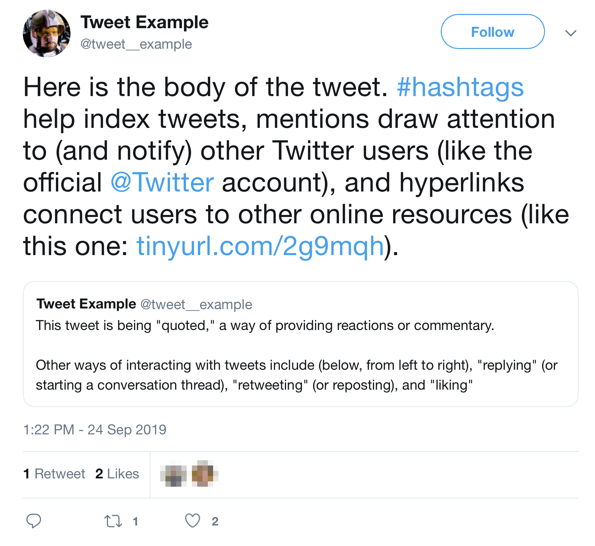

```{r setup, include=FALSE, message=FALSE}
usethis::use_git_ignore(c("*.csv", "*.rds"))
options(htmltools.dir.version = FALSE)

#titleSlideClass: [inverse, center, middle]
#"default", "metropolis", "metropolis-fonts", 

# see options for customize slides: 
# https://slides.yihui.name/xaringan/
# https://slides.yihui.name/xaringan/incremental.html
# https://github.com/yihui/xaringan/wiki

library(knitr)
library(tidyverse)
library(xaringan)
library(kableExtra)
```

class: inverse, center, middle

# Slides

[bretsw.github.io/job-talk-fsu](https://bretsw.github.io/job-talk-fsu/)

---

class: inverse, center, middle

# Introduction

---

class: inverse, center, top

```{r, out.width = "720px", echo = FALSE, fig.align = "center"}

```

My research investigates networked learning

in a variety of online communities,

addressing both possibilities and perils

by employing numerous learning analytics techniques.

---

class: inverse, center, top

```{r, out.width = "720px", echo = FALSE, fig.align = "center"}

```

My research investigates <span style="color:yellow">**networked learning**</span>

in a variety of online communities,

addressing both possibilities and perils

by employing numerous learning analytics techniques.

---

# Networked learning

```{r, out.width = "480px", echo = FALSE, fig.align = "center"}
include_graphics("img/network.jpg")
```

**Definition:** 

--

- The learning supported by the novel social and environmental conditions created by the internet.

<p style="font-size:50%">
Natriello, G. (2016). Networked learning. In L. Corno & E. M. Anderman (Eds.), <i>Handbook of educational psychology</i> (3rd ed.), pp. 337-348. Routledge.
</p>

--

- Especially *informal*, *self-directed*, and *just-in-time* (i.e., as needed) learning.

---

# Networked learning

```{r, out.width = "480px", echo = FALSE, fig.align = "center"}
include_graphics("img/network.jpg")
```

**Examples:** 

--

- Asking a specific question

--

- Looking for peers to discuss ideas and brainstorm

--

- Seeking out encouragement after a tough day

--

- A teacher searching for curricular materials

---

class: inverse, center, top

```{r, out.width = "720px", echo = FALSE, fig.align = "center"}

```

My research investigates networked learning

in a variety of <span style="color:yellow">**online communities**</span>,

addressing both possibilities and perils

by employing numerous learning analytics techniques.

---

# Online communities

```{r, out.width = "480px", echo = FALSE, fig.align = "center"}
include_graphics("img/computer.jpg")
```

**Definition:** 

--

- A group coming together around a shared affinity through the internet

--

- This often occurs *informally*, in a *self-organized* way

--

- May not resemble a traditional, offline community (e.g., local neighborhood, civic organization)

---

# Online communities

```{r, out.width = "480px", echo = FALSE, fig.align = "center"}
include_graphics("img/computer.jpg")
```

**Examples:** 

--

- Facebook group

--

- Twitter hashtag

--

- subreddit

---

class: inverse, center, top

```{r, out.width = "720px", echo = FALSE, fig.align = "center"}

```

My research investigates networked learning

in a variety of online communities,

addressing both <span style="color:yellow">**possibilities and perils**</span>

by employing numerous learning analytics techniques.

---

# Possibilities

```{r, out.width = "480px", echo = FALSE, fig.align = "center"}

```

--

- Learning spans both physical and digital spaces

<p style="font-size:50%">
Greenhow, C., Robelia, B., & Hughes, J. E. (2009). Learning, teaching, and scholarship in a digital age: Web 2.0 and classroom research: What path should we take now?. <i>Educational Researcher, 38</i>(4), 246-259.
</p>

--

- Informal learning influences learning in formal settings

<p style="font-size:50%">
Peters, M., & Romero, M. (2019). Lifelong learning ecologies in online higher education: Students' engagement in the continuum between formal and informal learning. <i>British Journal of Educational Technology, 50</i>(4), 1729-1743. 
</p>

---

# Perils

```{r, out.width = "480px", echo = FALSE, fig.align = "center"}

```

--

- Blurred boundaries between public and private, personal and professional

<p style="font-size:50%">
Fox, A., & Bird, T. (2017). The challenge to professionals of using social media: Teachers in England negotiating personal-professional identities. <i>Education and Information Technologies, 22</i>(2), 647–675.
</p>

<p style="font-size:50%">
Selwyn, N., Nemorin, S., & Johnson, N. (2017). High-tech, hard work: An investigation of teachers’ work in the digital age. <i>Learning, Media and Technology, 42</i>, 390–405.
</p>

--

- Harassment and abuse

<p style="font-size:50%">
Veletsianos, G., Houlden, S., Hodson, J., & Gosse, C. (2018). Women scholars’ experiences with online harassment and abuse: Self-protection, resistance, acceptance, and self-blame. <i>New Media & Society, 20</i>(12), 4689-4708.
</p>

---

# Possibilities and perils

```{r, out.width = "600px", echo = FALSE, fig.align = "center"}
include_graphics("img/jurassic-park.jpg")
```

<p style="font-size:50%">
Krutka, D. G., Heath, M. K., & Staudt Willet, K. B. (2019). Foregrounding technoethics: Toward critical perspectives in technology and teacher education. <i>Journal of Technology and Teacher Education, 27</i>(4), 555-574. http://learntechlib.org/p/208235/
</p>

<hr>

### "Your scientists were so preoccupied with whether they *could*, they didn't stop to think if they *should*."

~ Dr. Ian Malcolm, *Jurassic Park*

---

# Possibilities and perils

```{r, out.width = "600px", echo = FALSE, fig.align = "center"}
include_graphics("img/jurassic-park.jpg")
```

Alternative title for this talk: 

<hr>

**Networked learning: Your bioengineered T-Rex is awesome, but those teeth are sharp**

<hr>

---

class: inverse, center, top

```{r, out.width = "720px", echo = FALSE, fig.align = "center"}

```

My research investigates networked learning

in a variety of online communities,

addressing both possibilities and perils

by employing numerous <span style="color:yellow">**learning analytics**</span> techniques.

---

#  Digital traces

```{r, out.width = "420px", echo = FALSE, fig.align = "center"}
include_graphics("img/purpose.jpg")
```

--

To understand the complexities of networked learning: 

--

- I study **digital traces** of activity and behavior in online communities. 

--

  - **Definition:** residual, observable evidence of online activity

--

  - **Examples:** tweets, forum posts, user profiles

--

  - **Collection:** through techniques shared with educational data mining

---

#  Digital traces

```{r, out.width = "420px", echo = FALSE, fig.align = "center"}
include_graphics("img/purpose.jpg")
```

--

- I am able to unobtrusively gather real-world, *in situ* data

--

- These *digital traces* complement traditional *self-report* methods (reducing bias)

---

# Learning analytics

```{r, out.width = "480px", echo = FALSE, fig.align = "center"}
include_graphics("img/code.jpg")
```

--

**Learning analytics** techniques have allowed me to:

--

- Handle massive quantities of data

--

- Identify patterns and trends in messy datasets of digital traces

--

-	Infer possibilities and perils

---

# Flexible tools

```{r, out.width = "300px", echo = FALSE, fig.align = "center"}
include_graphics("img/R-logo.png")
```

--

Large datasets do not open in Excel, so I learned **R**

--

- R is a programming language and environment for statistical computing and graphics

--

- R has numerous *packages* useful for learning analytics:

--

  - **ggplot2** for data visualization
  
--
  
  - **igraph** for social network analysis
  
--
  
  - **caret** for machine learning

---

# New tools

```{r, out.width = "420px", echo = FALSE, fig.align = "center"}
include_graphics("img/package.png")
```

--

Sometimes, the tools I need don't exist yet.

--

- e.g., collecting tweets over time, processing Twitter data, and systematically analyze with a learning analytics perspective

--


  - I wanted to this Twitter data collection and analysis workflow easier for others 

--

  - so I built an R software package: **tidytags**: https://bretsw.github.io/tidytags/

---

class: inverse, center, top

```{r, out.width = "720px", echo = FALSE, fig.align = "center"}

```

My research investigates networked learning

in a variety of online communities,

addressing both possibilities and perils

by employing numerous learning analytics techniques.

---

class: inverse, center, middle

# Teachers' professional learning 

**(informal, ongoing professional development)**

---

class: inverse, center, middle

# Three dimensions of networked learning

---

class: inverse, left, top

# Three dimensions of networked learning

```{r, out.width = "720px", echo = FALSE, fig.align = "center"}

```

1. Broad understanding of learning as participation in online communities
2. Planned learning events in online communities
3. Long-term trends and implications for learning in online communities

---

class: inverse, left, top

# Three dimensions of networked learning

```{r, out.width = "720px", echo = FALSE, fig.align = "center"}

```

1. <span style="color:yellow">**Broad understanding of learning as participation in online communities**</span>
2. Planned learning events in online communities
3. Long-term trends and implications for learning in online communities

---

# 1. Twitter communities

```{r, out.width = "480px", echo = FALSE, fig.align = "center"}
include_graphics("img/twitter-purposes.png")
```

<p style="font-size:50%">
Staudt Willet, K. B. (2019). Revisiting how and why educators use Twitter: Tweet types and purposes in #Edchat. <i>Journal of Research on Technology in Education, 51</i>, 273-289. https://doi.org/10.1080/15391523.2019.1611507
</p>

<hr>

--


**Question:** How and why do teachers use Twitter?

--

**Platform:** Twitter

--

**Community:** \#Edchat hashtag

---

# 1. Twitter communities

```{r, out.width = "480px", echo = FALSE, fig.align = "center"}
include_graphics("img/twitter-purposes.png")
```

--

**Data collection:** 1,228,506 \#Edchat tweets

--

**Data analysis:** 

--

- Classification of tweet types

--

- Discourse analysis 

---

# Tweet example

```{r, out.width = "540px", echo = FALSE, fig.align = "center"}

```

---

# Twitter hashtags

```{r, out.width = "300px", echo = FALSE, fig.align = "center"}
include_graphics("img/hashtag.jpg")
```

--

**Many different uses of Twitter hashtags:**

--

- Topical index: #Teaching

--

- Humor and wit: #CoolTeacher

--

- Synchronous chats: #SatChat

--

- "Space" for ongoing discussions: #ITeachMath

---

# \#Edchat background

```{r, out.width = "300px", echo = FALSE, fig.align = "center"}
include_graphics("img/hashtag.jpg")
```

--

- \#Edchat is one of the oldest and busiest educational Twitter hashtags

--

- \#Edchat is self-described as:

> "...Twitter discussion that any educator can discuss and learn about current teaching trends, to integrate technology, to transform their education, and to connect with inspiring instructors around the world."

---

# 1. Twitter communities

```{r, out.width = "840px", echo = FALSE, fig.align = "center"}
include_graphics("img/twitter-original.png")
```

---

# 1. Twitter communities

```{r, out.width = "840px", echo = FALSE, fig.align = "center"}
include_graphics("img/twitter-retweets.png")
```

---

# 1. Twitter communities

```{r, out.width = "840px", echo = FALSE, fig.align = "center"}

```

---

# 1. Twitter communities

```{r, out.width = "360px", echo = FALSE, fig.align = "center"}

```

### Machine learning classifier

<p style="font-size:50%">
Staudt Willet, K. B., & Willet, B. D. (2018, October). Look who’s talking: Using human coding to establish a machine learning approach to Twitter education chats. In <i>AoIR selected papers of internet research</i>. Association of Internet Researchers. https://spir.aoir.org/ojs/index.php/spir/article/view/10512
</p>

<hr>

--

**Goal:** Automatically detect tweet purposes through a *logistic regression classifier*

--

- Identified 39 tweet features to build the classifier

--

- Compared efficacy of 10 different ML methods (e.g., random forest, *k*-nearest neighbors)

---

# 1. Twitter communities

```{r, out.width = "420px", echo = FALSE, fig.align = "center"}
include_graphics("img/twitter-purposes.png")
```

### Possibilities

--

- Huge amount of on-topic educational content (i.e., approximately 5,000 daily \#Edchat tweets)

--
  
- High engagement (e.g., retweeting others' content)

--

- Informal online learning environment likely holds implications for formal teaching and learning

---

# 1. Twitter communities

```{r, out.width = "420px", echo = FALSE, fig.align = "center"}
include_graphics("img/twitter-purposes.png")
```

### Perils

--

- Imbalance of needs being supported (e.g., nearly half of new \#Edchat content is self-promotional in nature)

--

- Volume of content is likely overwhelming for new Twitter users or new teachers

--

- Volume (and noise) of content is likely overwhelming for researchers

---

class: inverse, left, top

# Three dimensions of networked learning

```{r, out.width = "720px", echo = FALSE, fig.align = "center"}

```

**Possibilities and perils of:**

1. Broad understanding of learning as participation in online communities
2. <span style="color:yellow">**Planned learning events in online communities**</span>
3. Long-term trends and implications for learning in online communities

---

# 2. Twitter chats

```{r, out.width = "480px", echo = FALSE, fig.align = "center"}

```

<p style="font-size:50%">
Greenhalgh, S. P., Rosenberg, J. M., Staudt Willet, K. B., Koehler, M. J., & Akcaoglu, M. (2020). Identifying multiple learning spaces within a single teacher-focused Twitter hashtag. <i>Computers and Education, 148</i>, 103809. https://doi.org/10.1016/j.compedu.2020.103809
</p>

<hr>

--

**Question:** How do chat and non-chat contexts differ in Twitter communities?

--

**Platform:** Twitter

--

**Community:** \#michED hashtag

---

# 2. Twitter chats

```{r, out.width = "480px", echo = FALSE, fig.align = "center"}

```

--

**Data collection:** 84,004 \#michED tweets

--

**Data analysis:** 

--

- Natural language processing

--

- Multi-level modeling

---

# 2. Twitter chats

```{r, out.width = "480px", echo = FALSE, fig.align = "center"}

```

--

**Definition** of a Twitter *chat*:

--

- Agreed upon time (usually one hour every week) 

--

- A moderator posts questions using a hashtag

--

- Others respond more or less immediately using the same hashtag

---

# 2. Twitter chats
 
### Findings

&nbsp;
 
```{r, echo=FALSE, message=FALSE}
knitr::kable(
  bind_cols(
    c("18,816 tweets overall",
      "361.8 tweets per hour", 
      "Higher social processing and cognitive processing",
      "More likes and replies"
    ),
    c("65,188 tweets overall",
      "7.5 tweets per hour", 
      "",
      "More retweets, mentions, hashtags, and hyperlinks"
    )
  ),
  col.names = c("Synchronous chats", 
                "Asynchronous times"),
  format = 'html',
  table.attr = "style='width:90%;'"
) %>%
  kableExtra::kable_styling(
    bootstrap_options = c("striped", "hover"),
    full_width=TRUE
  ) %>%
  kableExtra::column_spec(1, 
                          width_min = "10em",
                          width_max = "15em"
  ) %>%
  kableExtra::column_spec(2, 
                          width_min = "10em",
                          width_max = "15em"
  ) %>%
  kableExtra::row_spec(0, align = 'center')
```

---

# 2. Twitter chats

```{r, out.width = "480px", echo = FALSE, fig.align = "center"}

```

### Possibilities

--

- The same digital space may be used in different ways:

--

  - e.g., focused burst of conversation requiring higher cognitive and social processing
  
--

  - Community within a community

---

# 2. Twitter chats

```{r, out.width = "480px", echo = FALSE, fig.align = "center"}

```

### Perils

--

- Volume may be too high (e.g., a new tweet every 10 seconds)

--

- Less connected to broader perspectives during a chat (i.e., fewer mentions, hashtags, hyperlinks)

---

class: inverse, left, top

# Three dimensions of networked learning

```{r, out.width = "720px", echo = FALSE, fig.align = "center"}

```

**Possibilities and perils of:**

1. Broad understanding of learning as participation in online communities
2. Planned learning events in online communities
3. <span style="color:yellow">**Long-term trends and implications for learning in online communities**</span>

---

# 3. Reddit trends

```{r, out.width = "600px", echo = FALSE, fig.align = "center"}
include_graphics("img/across-time.jpg")
```

<p style="font-size:50%">
Staudt Willet, K. B., & Carpenter, J. P. (in press). A tale of two subreddits: Change and continuity in teaching-related online spaces. <i>British Journal of Educational Technology</i>. https://doi.org/10.1111/bjet.13051
</p>

<hr>

--

**Question:** How has Reddit use by teachers changed over time?

--

**Platform:** Reddit

--

**Communities:** r/Teachers, r/education subreddits

---

# 3. Reddit trends

```{r, out.width = "600px", echo = FALSE, fig.align = "center"}
include_graphics("img/across-time.jpg")
```

--

**Data collection:** 1,036,278 Reddit posts and comments from two subreddits, spanning 3.5 years

--

**Data analysis:** 

--

- Trend analysis

--

- Natural language processing

--

- Social network analysis

---

# 3. Reddit trends

### Findings
 
&nbsp;
 
```{r, echo=FALSE, message=FALSE}
knitr::kable(
  bind_cols(
    c("Subscribers",
      "Contributors",
      "Posts",
      "Comments"
    ),
    c("204,000",
      "55,148", 
      "54,933",
      "641,727"
    ),
    c("122,000",
      "43,711", 
      "252,340",
      "82,278"
    )
  ),
  col.names = c("", 
                "r/Teachers", 
                "r/education"),
  format = 'html',
  table.attr = "style='width:90%;'"
) %>%
  kableExtra::kable_styling(
    bootstrap_options = c("striped", "hover"),
    full_width=TRUE
  ) %>%
  kableExtra::row_spec(0, align = 'center')
```

---

# 3. Reddit trends

### Findings

```{r, out.width = "720px", echo = FALSE, fig.align = "center"}
include_graphics("img/subreddit-posts-daily.png")
```

---

# 3. Reddit trends

### Findings

```{r, out.width = "720px", echo = FALSE, fig.align = "center"}

```

---

# 3. Reddit trends

### Findings

```{r, out.width = "720px", echo = FALSE, fig.align = "center"}
include_graphics("img/subreddit-posts-thread-length.png")
```

---

# 3. Reddit trends

```{r, out.width = "720px", echo = FALSE, fig.align = "center"}
include_graphics("img/across-time.jpg")
```

### Possibilities

--

- Rules and moderation make a difference: improving quality of conversation

--

- Variety of topics, potentially something for everyone

---

# 3. Reddit trends

```{r, out.width = "720px", echo = FALSE, fig.align = "center"}
include_graphics("img/across-time.jpg")
```

### Perils

--

- Online participation can change quickly, meaning a snapshot may be misleading

--

- Uneven experience between communities and within communities

---

class: inverse, left, top

# Three dimensions of networked learning

```{r, out.width = "720px", echo = FALSE, fig.align = "center"}

```

**Possibilities and perils of:**

1. Broad understanding of learning as participation in online communities
2. Planned learning events in online communities
3. Long-term trends and implications for learning in online communities

---

class: inverse, center, middle

# Significance

---

# Possibilities

```{r, out.width = "480px", echo = FALSE, fig.align = "center"}
include_graphics("img/chat.jpg")
```

--

**For participants:** 

--

- There's something for everyone: resources, links to articles, encouragement, conversations, social hang outs

--

- Opportunity for informal participation in online communities to influence formal teaching and learning

---

# Possibilities

```{r, out.width = "480px", echo = FALSE, fig.align = "center"}
include_graphics("img/chat.jpg")
```

**For researchers:**

--

- Massive amounts of data available

--

- Digital traces of public activity and behavior

--

- Can be studied as it happens

---

# Perils

```{r, out.width = "480px", echo = FALSE, fig.align = "center"}

```

--

**For participants:** 

--

- Equity issues are foregrounded:

--

  - Time required

--

  - Opportunity costs

--

  - Blurred boundaries

---

# Perils

```{r, out.width = "480px", echo = FALSE, fig.align = "center"}

```

**For researchers:** 

--

- Massive amounts of *messy* data available

--

- Complicated and nuanced *methodological* concerns get raised

--

- Complicated and nuanced *ethical* concerns get raised

---

class: inverse, center, middle

# My next steps

---

# Networked learning competencies

```{r, out.width = "480px", echo = FALSE, fig.align = "center"}
include_graphics("img/transition.jpg")
```

I will design **networked learning competencies**.

--

- Recommendations for performance improvement in using social media to pursue the *possibilities* of networked learning and avoid the *perils*

--

- Emergency response (e.g., pandemic, natural disaster)

--

- Job transitions (e.g., new teachers, new faculty, promotions)

---

# Networked learning competencies

```{r, out.width = "480px", echo = FALSE, fig.align = "center"}
include_graphics("img/transition.jpg")
```

I will design **networked learning competencies**.

These work should be of interest to funding agencies:

--

- NSF Research on Learning in Formal and Informal Settings

--

- NSF Innovative Technology Experiences for Students and Teachers (ITEST)

---

# Equity

```{r, out.width = "420px", echo = FALSE, fig.align = "center"}
include_graphics("img/help.jpg")
```

--

My research will aid the building of **equitable online communities**.

--

- Understand participants better:

--

  - Agency of users with minoritized identities

--

  - Harassment

--

  - Motivations of "lurkers"

---

# Equity

```{r, out.width = "420px", echo = FALSE, fig.align = "center"}
include_graphics("img/help.jpg")
```

My research will aid the building of **equitable online communities**.

- Craft recommendations that address inequities of networked learning in online communities

--

  - Rules and moderation

--

  - Navigating opportunity costs

---

class: inverse, center, middle

# My next steps

My research will aid the design of networked learning competencies

and building equitable online communities

---

class: inverse, left, top

# Thank you!

```{r, out.width = "420px", echo = FALSE, fig.align = "center"}
include_graphics("img/chat.jpg")
```

* **Email:** [staudtwi@msu.edu](mailto:staudtwi@msu.edu)

* **Web:** [bretsw.com](http://bretsw.com)

* **Twitter:** [@bretsw](https://twitter.com/bretsw)

* **GitHub:** [bretsw](https://github.com/bretsw)

* **Slides:** [bretsw.github.io/job-talk-fsu](https://bretsw.github.io/job-talk-fsu)
